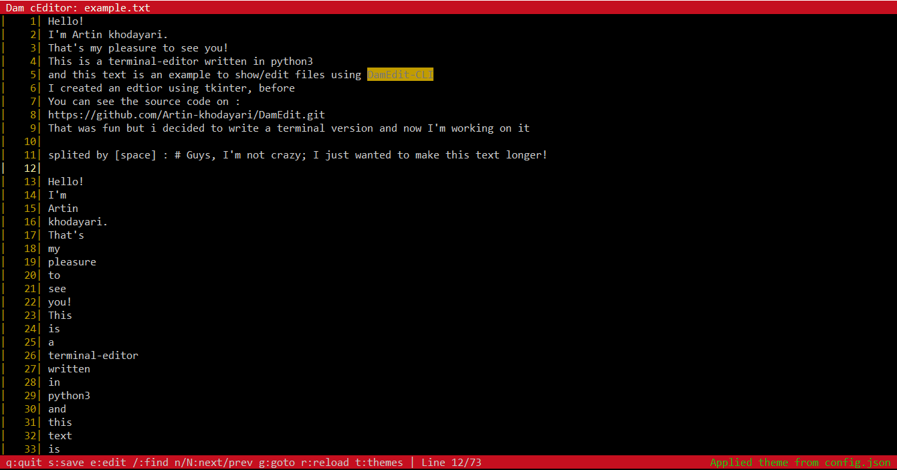

# DamEdit-CLI



---
# What is DamEdit-CLI?

- It's a simple terminal-editor witten in python but usefull.
- It uses `curses` to show/edit/change texts in terminal.
- It has a `config.json` file to change its colors

---
# Installation

To run editor :
```bash
python main.py <your_file>
```

---
# Contribute
Well, FEEL FREE!

---
# 🧑‍💻 About the Developer

This project is made by [Artin khodayari](https://github.com/Artin-khodayari).

You can contact me and report the problems and bugs to my [Gmail-Account](mailto:ArtinKhodayari2010@gmail.com)

Feel free to reach out for questions, feedback, or collaborations!